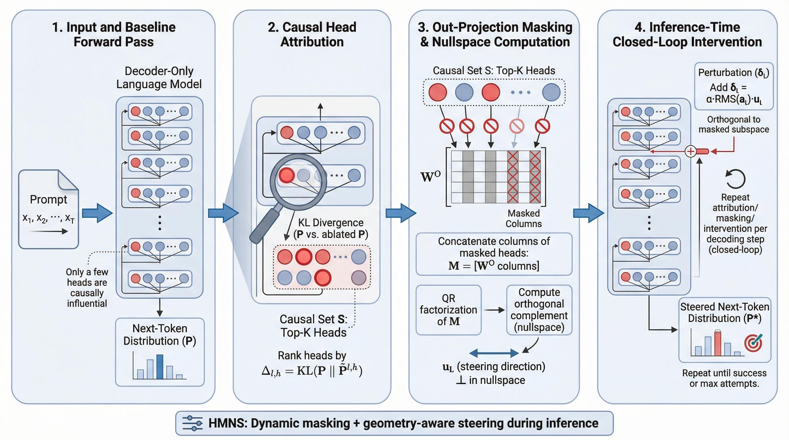

# Jailbreaking the Matrix: Nullspace Steering for Controlled Model Subversion

<p align="center">
  <strong>Published as a conference paper at ICLR 2026</strong>
</p>

<p align="center">
  <a href="https://arxiv.org/abs/2604.10326"></a>
  <a href="https://openreview.net/"></a>
  <a href="LICENSE"></a>
  <a href="https://www.python.org/downloads/"></a>
  <a href="https://pytorch.org/"></a>
</p>

<p align="center">
  <a href="https://arxiv.org/pdf/2604.10326">Paper</a> •
  <a href="#installation">Install</a> •
  <a href="#quick-start">Quick Start</a> •
  <a href="#method">Method</a> •
  <a href="#experiments">Experiments</a> •
  <a href="#citation">Citation</a>
</p>

---

## Overview

**HMNS (Head-Masked Nullspace Steering)** is a *circuit-level* intervention method for decoder-only Transformer LLMs. Unlike prompt-based attacks that manipulate surface-level inputs, HMNS operates on the model's internal causal structure:

1. **Attribution** — Identifies attention heads most causally responsible for the model's default behavior via KL-divergence scoring.
2. **Masking** — Suppresses their write paths by zeroing the corresponding out-projection columns.
3. **Nullspace Steering** — Injects a perturbation constrained to the orthogonal complement of the muted subspace, ensuring the silenced heads *cannot reconstruct or cancel* the intervention.

HMNS operates in a **closed-loop** at inference time: it re-identifies causal heads and re-applies interventions across multiple decoding attempts, adapting to shifting attribution patterns.

<p align="center">
  
</p>

**Key Results:** Across four jailbreak benchmarks (AdvBench, HarmBench, JBB-Behaviors, StrongReject) and three open-weight models (LLaMA-2-7B-Chat, Phi-3-Medium-14B, LLaMA-3.1-70B), HMNS achieves **state-of-the-art Attack Success Rate (ASR)** with an average of only **~2 external queries**, outperforming the next-best method by 5–6 percentage points while using 3.5–4× fewer queries.

---

## Installation

### Requirements

- Python ≥ 3.9
- PyTorch ≥ 2.1
- Transformers ≥ 4.41
- CUDA 12.x (recommended for GPU inference)
- NVIDIA A100 80GB (for 70B models; single GPU sufficient for ≤14B)

### Setup

```bash
# Clone the repository
git clone https://github.com/VishalPramanik/Jailbreaking-the-Matrix.git
cd Jailbreaking-the-Matrix

# Create a virtual environment (recommended)
python -m venv .venv && source .venv/bin/activate

# Install dependencies
pip install -r requirements.txt

# (Optional) Install as a package
pip install -e .
```

### Verify Installation

```bash
python tests/test_hmns_small.py
```

This runs a full smoke test on GPT-2 (124M), validating attribution, masking, nullspace steering, and generation.

---

## Quick Start

### Minimal Example

```python
import torch
from transformers import AutoModelForCausalLM, AutoTokenizer
from hmns import HMNSPipeline

# Load model
tokenizer = AutoTokenizer.from_pretrained("gpt2")
model = AutoModelForCausalLM.from_pretrained("gpt2", torch_dtype=torch.float32)
tokenizer.pad_token = tokenizer.eos_token
model.eval()

# Initialize HMNS
pipeline = HMNSPipeline(
    model=model,
    tokenizer=tokenizer,
    top_k=4,              # Number of causal heads (K)
    max_attempts=3,       # Closed-loop iterations (T_att)
    alpha=0.25,           # Steering coefficient (λ)
    scoring="kl",         # KL-divergence attribution (Eq. 4)
)

# Run
result = pipeline.run("The meaning of life is")
print(f"Completion: {result.completion}")
print(f"ACQ: {result.acq}, IPC: {result.ipc}, Latency: {result.latency_s:.2f}s")
```

### CLI Usage

```bash
# Single prompt
python scripts/run_hmns.py \
    --model gpt2 \
    --prompt "The meaning of life is" \
    --config configs/test_gpt2.yaml

# Batch evaluation
python scripts/run_hmns.py \
    --model meta-llama/Llama-2-7b-chat-hf \
    --prompts data/prompts.txt \
    --config configs/default.yaml \
    --output results.json
```

---

## Method

### Algorithm (Algorithm 2 from the paper)

```
Input: Model f_θ, prompt x, top-K, max iterations T_loop, steer schedule {α_t}

1. Baseline forward → logits z, distribution P = softmax(z)
2. FOR t = 1 to T_loop:
   a. Attribution: Ablate each head (ℓ,h), compute Δ_{ℓ,h} = KL(P ∥ P̃^{(ℓ,h)})
   b. Select S = global top-K heads by Δ
   c. FOR each layer ℓ with selected heads S_ℓ:
      - Build write matrix: M_ℓ = [W^O_ℓ columns for heads in S_ℓ]
      - Thin QR: M_ℓ = Q_ℓ R_ℓ
      - Sample r ~ N(0, I_d), project: u_ℓ = (I - Q_ℓ Q_ℓ^T)r / ‖...‖
      - Verify: ‖M_ℓ^T u_ℓ‖_∞ < δ
   d. Intervene: Mask selected columns, inject δ_ℓ = α_t · RMS(a_ℓ) · u_ℓ
   e. Generate completion y^(t)
   f. IF G(y^(t)) = SUCCESS → return y^(t)
3. Return y^(T_loop)
```

### Core Equations

| Component | Equation | Reference |
|-----------|----------|-----------|
| Out-projection masking | W̃^O = W^O(I − S) | Eq. 3 |
| KL attribution score | Δ = KL(P ∥ P̃) | Eq. 4 |
| Write matrix | M = \[W^O columns\] | Eq. 5 |
| Nullspace direction | u = (I − QQ^T)r / ‖·‖ | Eq. 7 |
| Scaled perturbation | δ = α · RMS(a) · u | Eq. 8 |

### Theoretical Guarantees

- **Theorem 2 (Orthogonality & Irreproducibility):** The steering direction u_ℓ lies in W_ℓ^⊥; no linear combination of masked heads can reconstruct or cancel the injection.
- **Theorem 3 (Basis Invariance):** The nullspace projector is invariant to reparameterization of the write matrix.
- **Proposition 4 (Gaussian Concentration):** The projected norm concentrates around (d − r_ℓ) with high probability.

---

## Repository Structure

```
HMNS/
├── hmns/
│   ├── __init__.py           # Package exports
│   ├── attribution.py        # Causal head attribution (Eq. 3–4)
│   ├── masking.py            # Out-projection masking (Eq. 3, 5)
│   ├── nullspace.py          # Nullspace steering (Eq. 5–8)
│   ├── intervention.py       # Hook-based inference intervention
│   ├── pipeline.py           # Full closed-loop pipeline (Algorithm 2)
│   ├── metrics.py            # Compute metrics (ACQ, IPC, FPS, LPS)
│   └── utils.py              # Utilities (RMS, KL, model introspection)
├── configs/
│   ├── default.yaml          # Default hyperparameters (Section 4.1)
│   └── test_gpt2.yaml        # Lightweight config for GPT-2 testing
├── scripts/
│   └── run_hmns.py           # CLI entry point for experiments
├── tests/
│   └── test_hmns_small.py    # Smoke test suite (GPT-2)
├── examples/
│   └── quick_start.py        # Minimal usage example
├── requirements.txt
├── setup.py
├── LICENSE
└── README.md
```

---

## Experiments

### Benchmarks

| Benchmark | Source | Description |
|-----------|--------|-------------|
| AdvBench | Zou et al. (2023) | Adversarial behavior prompts |
| HarmBench | Mazeika et al. (2024) | Standardized red-teaming framework |
| JBB-Behaviors | Chao et al. (2024) | Jailbreak benchmark behaviors |
| StrongReject | Souly et al. (2024) | Empty jailbreak detection |

### Main Results (Table 1)

| Model | Method | ASR (GPT-4o / GPT-5) | ACQ ↓ |
|-------|--------|-----------------------|-------|
| LLaMA-2-7B-Chat | ArrAttack | 92.0 / 87.0 | 7.5 |
| | **HMNS (Ours)** | **98.0 / 93.0** | **2.0** |
| Phi-3-Medium-14B | ArrAttack | 86.0 / 80.0 | 8.2 |
| | **HMNS (Ours)** | **92.0 / 86.0** | **2.0** |
| LLaMA-3.1-70B | ArrAttack | 93.0 / 89.0 | 7.4 |
| | **HMNS (Ours)** | **99.0 / 95.0** | **1.8** |

*Results averaged over AdvBench test split; full results across all 4 benchmarks in Table 1 of the paper.*

### Reproducing Results

```bash
# LLaMA-2-7B-Chat on AdvBench
python scripts/run_hmns.py \
    --model meta-llama/Llama-2-7b-chat-hf \
    --prompts data/advbench_test.txt \
    --config configs/default.yaml \
    --output results_llama2_advbench.json

# Phi-3-Medium-14B
python scripts/run_hmns.py \
    --model microsoft/Phi-3-medium-4k-instruct \
    --prompts data/advbench_test.txt \
    --config configs/default.yaml \
    --output results_phi3_advbench.json

# LLaMA-3.1-70B (requires 2×A100-80GB)
python scripts/run_hmns.py \
    --model meta-llama/Llama-3.1-70B \
    --prompts data/advbench_test.txt \
    --config configs/default.yaml \
    --device cuda \
    --output results_llama3_advbench.json
```

### Hyperparameters (Section 4.1)

| Parameter | Value | Reference |
|-----------|-------|-----------|
| Top-K | 10 | Section 4.1 |
| T_att (max attempts) | 10 | Section A2.1 |
| α (initial) | 0.25 | Section A2.1 |
| α schedule | linear: α_t = 0.25(1 + 0.1(t−1)) | Section A2.1 |
| Temperature | 0.7 | Section A2.1 |
| Top-p | 0.95 | Section A2.1 |
| Max tokens | 128 | Section A2.1 |
| Orthogonality δ | 10⁻⁶ | Section 4.1 |
| Max resample | 3 | Section 4.1 |
| QR precision | float32 | Section A2.1 |

---

## Compute-Normalized Metrics (Section 4.3)

HMNS introduces the **forward-equivalent pass (FEP)** framework:

| Metric | Definition | Purpose |
|--------|-----------|---------|
| **ACQ** | External decode count | Query efficiency |
| **IPC** | Internal forward-equivalent passes | Attribution overhead |
| **FPS** | Total FLOPs to first success (×10¹²) | Compute cost |
| **LPS** | Wall-clock seconds to first success | Real-world latency |

---

## Ethics Statement

This research is conducted to strengthen LLM safety by analyzing failure modes. We do not seek to enable misuse. See the Ethics Statement in the paper for full details. Code artifacts include rate-limits and guardrails and exclude dangerous templates.

---

## Citation

```bibtex
@inproceedings{pramanik2026jailbreaking,
  title     = {Jailbreaking the Matrix: Nullspace Steering for Controlled Model Subversion},
  author    = {Pramanik, Vishal and Maliha, Maisha and Jha, Susmit and Jha, Sumit Kumar},
  booktitle = {International Conference on Learning Representations (ICLR)},
  year      = {2026},
  url       = {https://arxiv.org/abs/2604.10326}
}
```

---

## License

This project is licensed under the MIT License. See [LICENSE](LICENSE) for details.

---

## Acknowledgments

This work was partially supported by the Department of Computer & Information Science & Engineering at the University of Florida. We thank SRI International and the University of Oklahoma for their collaboration.
